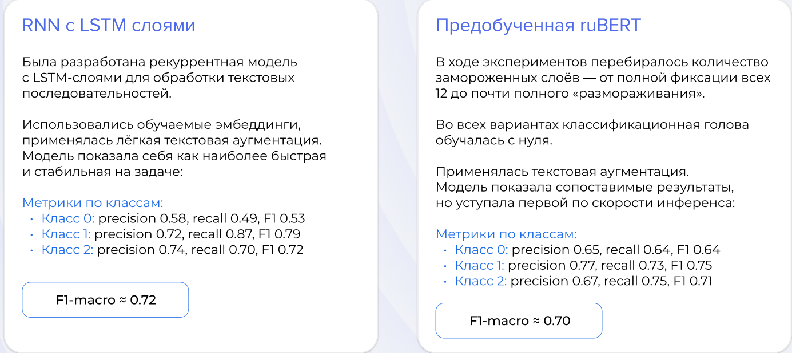

# MISIS x MEOW

# Состав команды

Музафарова Наиля- UX/UI Designer
Иванов Никита - Frontend Developer
Даурцев Егор - Backend Developer
Петров Дмитрий - Data Scientist / Data Engineer
Громова Анастасия - Pitcher

# Решение

Веб сервис для предсказания тональности русскоязычного текста.



Видеодемонстрация https://drive.google.com/file/d/1kvvuOG0ksr0byXoMmisMma62OpZPq3sJ/view?usp=sharing


Задеплоенный проект
https://hack-change-2025-lurq.vercel.app/


## Основной функционал

- Регистрация пользователя и вход пользователя по паролю
- Предсказание тональности для одного текста
- Предсказание тональности для датасета текстов, возможность загрузить датасет для предсказания в формате .csv
- филтрация результатов предсказания по тональностям и источникам
- построение интерактивных диаграмм распредления тональностей
- Возможность сохранять предсказанные классы в виде отчета в формате .csv
- Хранение .csv отчетов и возможность загружать ранее сохраненные отчеты
- Загрузка размеченного CSV для получения расчитанных метрик (показ macro‑F1 + precision/recall/F1 по каждому классу )


## BACKEND with ruBERT

Настройка переменных окружения
```
cd backend
cp example.env .env
```

Веса модели находятся по адресу https://drive.google.com/drive/folders/1FMI1DU-I_-SKcuS86Hot4BkNMQKEwA_q

Перед запсуком бекенда необходимо подгрузить их в директорию `backend/src/ml/`

```
backend/src/ml/
├── ....
├── full_model_weights.pt
├── rubert_local
└── rubert_tokenizer_local
```

Сборка и запуск бекенда:

```
docker compose up --build
```

Документация и описания ручек будут доступно по
```http://${host}:${port}$/sentimental-api//docs```

### Структура
```
backend/
└── src
    ├── data # сюда сохраняются отчеты с классифкацией
    ├── db
    │   └── # описание orm моделей базы данных, скрипты для работы с бд
    ├── ml # модуль с ml-моделью
    │   ├── rubert_local
    │   └── rubert_tokenizer_local
    ├── routers # ручки
    │   └── ...
    ├── schemas # pydantic сехмы для сериализации
    │   └── ...
    └── services # сервисный слой
        └── ...
```

## BACKEND with custom rnn

Настройка переменных окружения
```
cd custom_rnn_backend
cp example.env .env
```

Сборка и запуск бекенда:

```
docker compose up --build
```

структура аналогична бекенду с ruBERT`ом

## Frontend

Это Frontend часть на Next.js для сервиса «Анализа Москвы»: дашборд с загрузкой отчётов, фильтрами отзывов и метриками ML. Код может запускаться как напрямую из консоли, так и в Docker-контейнере.

### Переменные окружения

- `.env.local` с публичными переменными Next.js. Минимальный набор:

```bash
NEXT_PUBLIC_API_BASE_URL=http://localhost:8000
NEXT_PUBLIC_JWT_SECRET=change-me
```

> В Docker-файле эти переменные задаются через `ENV`

### Запуск из консоли

```bash
# установка зависимостей (однократно)
npm ci

# режим разработки с hot reload
npm run dev

# проверка lint-правил
npm run lint

# production-сборка и запуск
npm run build
npm run start
```

Приложение слушает `http://localhost:3000`. Для подключения к другому API обновите `NEXT_PUBLIC_API_BASE_URL`.

### Запуск через Docker

1. Соберите образ:

```bash
docker build -t hack-change-frontend .
```

2. Запустите контейнер, пробросив порт и при необходимости переопределив переменные окружения:

```bash
docker run --rm \
	-p 3000:3000 \
	-e NEXT_PUBLIC_API_BASE_URL=https://api.example.com \
	-e NEXT_PUBLIC_JWT_SECRET=change-me \
	--name hack-change-frontend \
	hack-change-frontend
```

Многостадийный Dockerfile собирает зависимости, билдит Next.js и запускает `npm run start` в production-среде.

### Используемые библиотеки

- `next` 16 + `react` 19 — каркас приложения (App Router, SSR/ISR).
- `tailwindcss` 4 — утилитарная стилизация компонентов и сеток.
- `zustand` — сторы `auth` и `reports` с минимальной логикой синхронизации.
- `axios` — HTTP-клиент, сконфигурированный в `src/lib/api.ts`.
- `react-hook-form`, `@hookform/resolvers`, `zod` — формы авторизации/загрузок и типобезопасная валидация.
- `echarts`, `echarts-for-react` — диаграммы тональности и ML-метрик.
- `cookies-next`, `jose` — работа с JWT в браузере.

### Архитектура каталога `src`

- `src/app` — страницы и layout'ы App Router. Ключевые зоны: `dashboard` (дашборд), `auth` (логин/регистрация), `demo`, глобальные стили `globals.css` и корневые layout'ы.
- `src/components` — UI-модули: `dashboard` (карточки, таблицы, фильтры), `auth` (формы входа), общий `file-upload-modal`.
- `src/hooks` — кастомные хуки (`use-file-upload`, `use-review-filters`) для локального состояния и побочных эффектов.
- `src/lib` — инфраструктура: `api.ts` (axios-инстанс), `reports.ts` (CRUD по отчётам), `token.ts` (декодирование JWT), `tone.ts` (метаданные тональностей).
- `src/store` — Zustand-хранилища (`auth-store.ts`, `reports-store.ts`).
- `src/types` — общие типы домена (`ReviewItem`).
